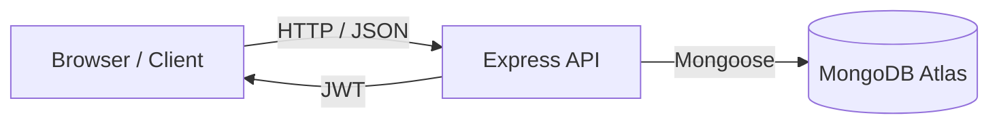
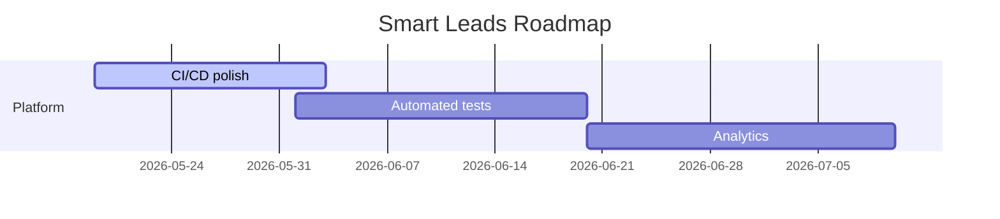

<!--
   README generated for Smart Leads Dashboard.
   Keep this file in sync with the repo as the project evolves.
-->

# Smart Leads Dashboard

> Secure CRM-style lead management for sales teams.

## Table of Contents

- [Overview](#overview)
- [File Structure](#file-structure)
- [Features](#features)
- [Architecture](#architecture)
- [Tech Stack](#tech-stack)
- [Getting Started](#getting-started)
- [Usage](#usage)
- [Configuration Reference](#configuration-reference)
- [Examples & Recipes](#examples--recipes)
- [Testing](#testing)
- [Roadmap](#roadmap)
- [Contributing](#contributing)
- [Security](#security)
- [Performance](#performance)
- [FAQ](#faq)
- [Acknowledgements](#acknowledgements)
- [License](#license)

## Overview

Smart Leads Dashboard is a full-stack MERN application for managing sales leads with secure JWT authentication, role-based permissions, lead CRUD, filtering, pagination, CSV export, and a modern Tailwind-powered UI.

It exists to provide a production-minded example of a CRM-style dashboard that is easy to run locally, easy to deploy, and straightforward to extend.

It is built for:

- frontend engineers who want a polished React + TypeScript app,
- backend engineers who want a clean Express + MongoDB API,
- and teams that need a practical internal sales dashboard.

Key differentiators:

- TypeScript on both client and server.
- Runtime schema validation with Zod.
- JWT auth with bcrypt password hashing.
- Clear separation of UI, API, validators, and shared types.

## File Structure

```text
ServiceHive/
├─ client/                  # React + Vite frontend
│  ├─ src/
│  │  ├─ api/               # API client wrappers
│  │  ├─ components/        # Shared UI and layout components
│  │  ├─ context/           # Auth and theme context providers
│  │  ├─ hooks/             # Custom React hooks
│  │  ├─ pages/             # Route-level pages
│  │  ├─ routes/            # Route guards and navigation helpers
│  │  ├─ types/             # Client-side TypeScript types
│  │  └─ utils/             # Utility helpers
│  ├─ index.html            # Vite entry HTML
│  ├─ package.json          # Frontend scripts and dependencies
│  └─ vercel.json           # SPA rewrite rules for Vercel
├─ server/                  # Express + MongoDB backend
│  ├─ src/
│  │  ├─ config/            # Environment and database setup
│  │  ├─ controllers/       # Request handlers
│  │  ├─ middleware/        # Auth, error, and role middleware
│  │  ├─ models/            # Mongoose models
│  │  ├─ routes/            # API route definitions
│  │  ├─ types/             # Server-side TypeScript types
│  │  ├─ utils/             # JWT, async, and response helpers
│  │  └─ validators/        # Zod schemas
│  ├─ package.json          # Backend scripts and dependencies
│  └─ tsconfig.json         # TypeScript config
├─ docker-compose.yml       # Local multi-service setup
├─ render.yaml              # Render backend deployment blueprint
├─ LICENSE                  # MIT license text
└─ README.md                # Project documentation
```

## Features

- Secure sign-in and registration with JWTs.
- Role-aware access for `admin` and `sales` users.
- Lead list with pagination, search, filtering, and sorting.
- Lead create/edit/delete flows.
- CSV export for filtered lead data.
- Modern dark UI with reusable components.
- Centralized error handling and API response helpers.
- TypeScript-first development experience.


Suggested tools:

- [Asciinema](https://asciinema.org) for terminal captures.
- [VHS](https://github.com/charmbracelet/vhs) for scripted terminal demos.

## Architecture



Component breakdown:

- `client/`: Vite React app, pages, reusable UI, auth context, data hooks.
- `server/`: Express API, routes, controllers, validators, models, middleware, and utils.
- `docker-compose.yml`: local MongoDB + app orchestration.

Data flow:

1. The client posts credentials to `/api/auth/login`.
2. The server validates input with Zod, verifies the user in MongoDB, and compares the password hash.
3. The server returns a signed JWT and sanitized user profile.
4. The client stores the token and attaches it to future requests.

## Tech Stack

| Area | Technology | Purpose |
| :-- | :-- | :-- |
| Frontend | React, Vite, TypeScript | UI and app shell |
| Styling | TailwindCSS | Utility-first styling |
| Data fetching | Axios, React Query | API calls and caching |
| Backend | Node.js, Express, TypeScript | REST API |
| Database | MongoDB, Mongoose | Persistent storage |
| Auth | JWT, bcryptjs | Authentication and hashing |
| Validation | Zod | Runtime validation |
| Tooling | ESLint, Prettier, tsx | Code quality and dev workflow |

## Getting Started

Prerequisites:

- Node.js 18+ recommended.
- npm installed.
- MongoDB Atlas account or a local MongoDB instance.

Installation:

```bash
git clone <your-repo-url>
cd ServiceHive
cp .env.example .env
cd server && npm install
cd ../client && npm install
```

Run locally:

```bash
# terminal 1
cd server
npm run dev

# terminal 2
cd client
npm run dev
```

Docker:

```bash
docker compose up --build
```

Quick health check:

```bash
curl http://localhost:5000/api/health
```

Troubleshooting:

- If the server fails with `ECONNREFUSED`, MongoDB is not reachable at `MONGO_URI`.
- For Atlas, ensure the database user exists and the IP allowlist includes your client/server host.
- For the client, confirm `VITE_API_URL` points to the deployed API, not localhost.


```bash
curl -X POST http://localhost:5000/api/auth/register \
   -H 'Content-Type: application/json' \
   -d '{"name":"Alice","email":"alice@example.com","password":"hunter2"}'
```

API response shape:

```json
{
   "success": true,
   "message": "Login successful",
   "data": {
      "user": {
         "id": "...",
         "name": "Alice",
         "email": "alice@example.com",
         "role": "sales",
         "createdAt": "2026-05-19T00:00:00.000Z"
      },
      "token": "eyJ..."
   }
}
```

Configuration options:

| Name | Type | Default | Description |
| :-- | :-- | :-- | :-- |
| `MONGO_URI` | string | required | MongoDB connection string |
| `JWT_SECRET` | string | required | JWT signing secret |
| `JWT_EXPIRES_IN` | string | `7d` | Token lifetime |
| `PORT` | number | `5000` | Backend port |
| `CLIENT_URL` | string | required | Allowed CORS origin |
| `VITE_API_URL` | string | `http://localhost:5000/api` | Client API base URL |

## Configuration Reference

Complete example:

```env
MONGO_URI=mongodb+srv://<user>:<password>@cluster0.mongodb.net/smart-leads-dashboard?retryWrites=true&w=majority
JWT_SECRET=replace_with_a_long_random_secret
JWT_EXPIRES_IN=7d
PORT=5000
CLIENT_URL=https://your-frontend-domain.com
VITE_API_URL=https://your-backend-domain.com/api
```

Feature flags:

- None are currently implemented in code.

## Examples & Recipes

Recipe 1: run a local dev stack.

```bash
cd server && npm run dev
cd client && npm run dev
```

Recipe 2: validate the API health endpoint.

```bash
curl http://localhost:5000/api/health
```

Recipe 3: build for production.

```bash
cd server && npm run build
cd client && npm run build
```

Recipe 4: inspect the auth endpoint.

```bash
curl -X POST http://localhost:5000/api/auth/login -H 'Content-Type: application/json' -d '{"email":"x@y.com","password":"secret"}'
```

## Testing

Current state:

- No dedicated automated test suite is checked in yet.

Suggested additions:

- Server: Jest + Supertest for route/controller tests.
- Client: React Testing Library for key forms and navigation.

Run type checks and linting:

```bash
cd server && npm run typecheck && npm run lint
cd client && npm run typecheck && npm run lint
```

## Roadmap



## Contributing

Workflow:

1. Fork the repo.
2. Create a branch: `git checkout -b feat/my-change`.
3. Commit with conventional commits.
4. Open a pull request with a clear description and screenshots when applicable.

Code style:

- Run ESLint and TypeScript checks before opening a PR.
- Keep functions small and typed.

Bug reports:

- Open an issue with reproduction steps, expected behavior, and screenshots/logs.

Feature requests:

- Describe the use case, constraints, and any UI/API expectations.

## Security

Supported versions:

| Component | Supported |
| :-- | :-- |
| Node.js | 18+ recommended |
| MongoDB | Atlas or local MongoDB 6+ |

Report vulnerabilities privately to the maintainers instead of opening a public issue.

Security best practices:

- Use a strong `JWT_SECRET`.
- Keep `.env` out of version control.
- Restrict Atlas network access.
- Use TLS in production.

## Performance

No formal benchmarks are checked in yet.

Practical considerations:

- Mongoose connection reuse is important in serverless or autoscaled deployments.
- React Query helps prevent unnecessary refetching.
- Pagination and filtering reduce payload size for lead lists.

## FAQ

Q: Why does the server fail with `ECONNREFUSED`?
A: MongoDB is not reachable at the configured `MONGO_URI`.

Q: Can I use Atlas for production?
A: Yes, and that is the recommended path.

Q: Where do I change the API base URL for the client?
A: Set `VITE_API_URL` in the client environment.

Q: Why are there two `.env` files?
A: The repo currently includes root and server-level env files; keep them consistent or centralize config for deployment.

Q: Is there a test suite?
A: Not yet; linting and type checking are available.

Q: How are passwords stored?
A: They are hashed with bcryptjs before persistence.

Q: Can sales users delete leads?
A: No, delete is admin-only.

## Acknowledgements

- React
- Vite
- Express
- MongoDB / Mongoose
- TailwindCSS
- Zod
- React Query


## License

[](LICENSE)

MIT - you can use, modify, and distribute this project with attribution.

## Footer

- LinkedIn: 
- GitHub: https://github.com/Shayan-Bhowmik
- Twitter/X: https://x.com/Shayan_Bhowmik_

Made by Shayan Bhowmik.

If this helped you, please star the repo!
